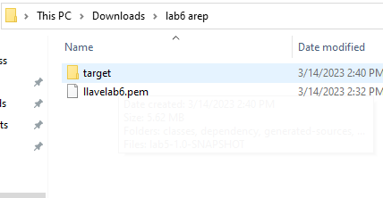
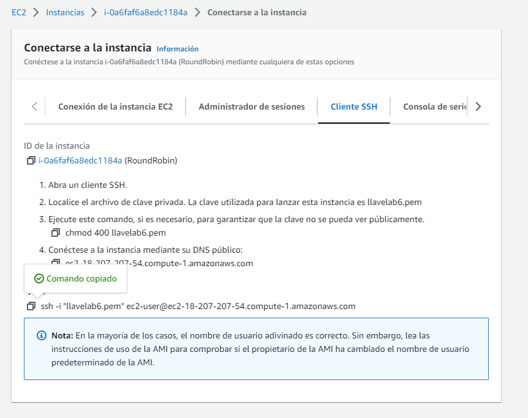
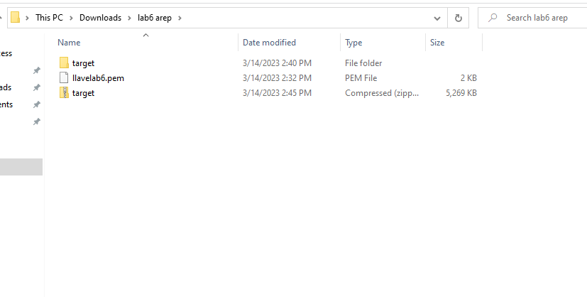
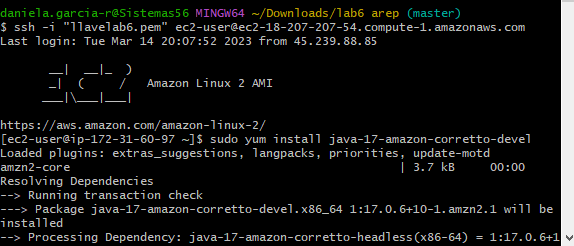
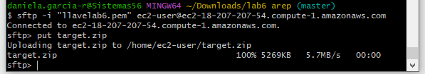

# LABORATORIO 5 AREP

### Autor: Daniela Garcia 


Este laboratorio cuenta con tres servidores y para distribuir la carga se usa Round Robin que lo que hace es dividirla en tres y asi lograr balancearla para que no se sature el servidor.

Para el despliegue se usa Docker el cual automatiza este proceso usando contenedores.

## Conceptos

### Docker

"*Docker es un proyecto de código abierto que automatiza el despliegue de aplicaciones dentro de contenedores de software, proporcionando una capa adicional de abstracción y automatización de virtualización de aplicaciones en múltiples sistemas operativos.*"


### Round Robin
"*Round-robin es un método para seleccionar todos los abstractos en un grupo de manera equitativa y en un orden racional, normalmente comenzando por el primer elemento de la lista hasta llegar al último y empezando de nuevo desde el primer elemento.*"


### EC2
*"EC2 permite a los usuarios alquilar computadores virtuales en los cuales pueden ejecutar sus propias aplicaciones."*


### MongoDB
"*MongoDB es un sistema de base de datos NoSQL, orientado a documentos y de código abierto. En lugar de guardar los datos en tablas, tal y como se hace en las bases de datos relacionales, MongoDB guarda estructuras de datos BSON (una especificación similar a JSON) con un esquema dinámico, haciendo que la integración de los datos en ciertas aplicaciones sea más fácil y rápida.*"


### Prerequisitos
* Maven: Herramienta para la gestión y construcción de proyectos.
* Java: Lenguaje de programación.
* Git: Sistema de control de versiones distribuido.
* Docker: plataforma de software para permite crear, probar e implementar aplicaciones rápidamente.

## Solución


### Uso de la aplicación

Para poder correr el programa se deben seguir los siguientes pasos:
* Clonar el respositorio con el comando

```
git clone https://github.com/danielagar320/LABORATIO05-AREP.git

```

* Con los siguientes comandos descargamos las dependencias en el target.

```
mvn clean install

```

* Construimos los servicios y los corremos en Docker con los siguientes comandos:

```
docker-compose build 

docker-compose up -d 
```


* En Docker Hube creamos tres respositorios diferntes.



* Subimos las images a los repositorios con los siguientes comandos:

```
docker tag nombre-imagen usuario/repositorio

docker login

git push usuario/repositorio
```






* En AWS creamos una instancia de EC2



* Por nedio de git bash nos conectamos a la maquina


* Con los siguientes comandos subimos las imagenes creadas a AWS.

```
sudo docker run -d -p 42000:6000 --name roundrobin danielagar320/web
sudo docker run -d -p 34000:6000 --name log1 danielagar320/instancia
sudo docker run -d -p 34001:6000 --name log2 danielagar320/instancia
sudo docker run -d -p 34002:6000 --name log3 danielagar320/instancia
sudo docker run -d -p 27017:6000 --name mongodb danielagar320/mongodb
```


* Abrimos el puerto 42000 en la instancia de EC2.


* Verificamos el funcionamiento con la direccion DNS proporcionada por la instancia.



### Autor

* **Daniela García Romero**:[danielagar320](https://github.com/danielagar320)