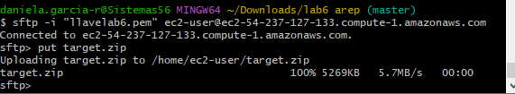

# LABORATORIO 5 AREP

### Autor: Daniela Garcia 

En este laboratorio se creara una aplicación con la arquitectura propuesta y se desplegara en AWS usando EC2, ELB y autoescalado.


### Prerequisitos
* Maven: Herramienta para la gestión y construcción de proyectos.
* Java: Lenguaje de programación.
* Git: Sistema de control de versiones distribuido.
* Docker: plataforma de software para permite crear, probar e implementar aplicaciones rápidamente.

## Solución


### Uso de la aplicación

Para poder correr el programa se deben seguir los siguientes pasos:
* Clonar el respositorio con el con siguiente comando:

```

git clone https://github.com/danielagar320/LABORATORIO06-AREP

```
* Creamos 5 instancias de maquinas virtuales y cada una será un servidor. Para todas las instancias se tendra un mismo grupo de seguriudad. 


* Por medio de la conexion SSH nos conectamos a la consola para para hacer las instalaciones


* Instalamos java en cada una de las instancias menos en la de mongo con el comando

```
sudo yum install java-17-amazon-corretto-devel

```


* Instancia 3


* Instancia 2


* Instancia 1



* RoundRobin


* Para verificar que se instalo correctamente usamos el siguiente comando:

```

java -version

```


* Abrimos la consola en la instancia de mongo y por medio del comando vi creamos un archivo

```
sudo vi /etc/yum.repos.d/mongodb-org-6.0.repo

```

* En el archivo anteriormente creado agregamos lo siguiente:

```
[mongodb-org-6.0]
name=MongoDB Repository
baseurl=https://repo.mongodb.org/yum/amazon/2/mongodb-org/6.0/x86_64/
gpgcheck=1
enabled=1
gpgkey=https://www.mongodb.org/static/pgp/server-6.0.asc

```


* Ahora instalamos mongo con el siguiente comando:

```
sudo yum install -y mongodb-org

```


* Para que mongo acepte cualquier ip y pueda consultar la base de datos entramos al archivo de configuración con el siguiente comando y cambiamos la sección bindIP

```
sudo vi /etc/mongod.conf

```


* Ahora ejectuamos el servicio mongo

```
sudo systemctl start mongod

```

* Verificamos que el servicio se este corriendo

```
sudo systemctl status mongod

```


* Se debe modificar la url de la conexion a mongo con la ip publica de la instancia de mongo seguido del puerto 27017

* Para que el RoundRobin decida, agregamos las ip publicas de las intancias 


* 


```

mvn clean install

```


### Autor

* **Daniela García Romero**:[danielagar320](https://github.com/danielagar320)
